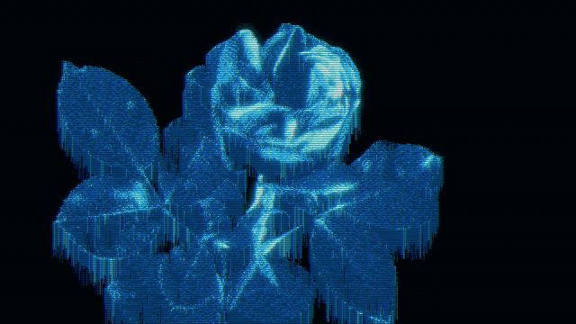
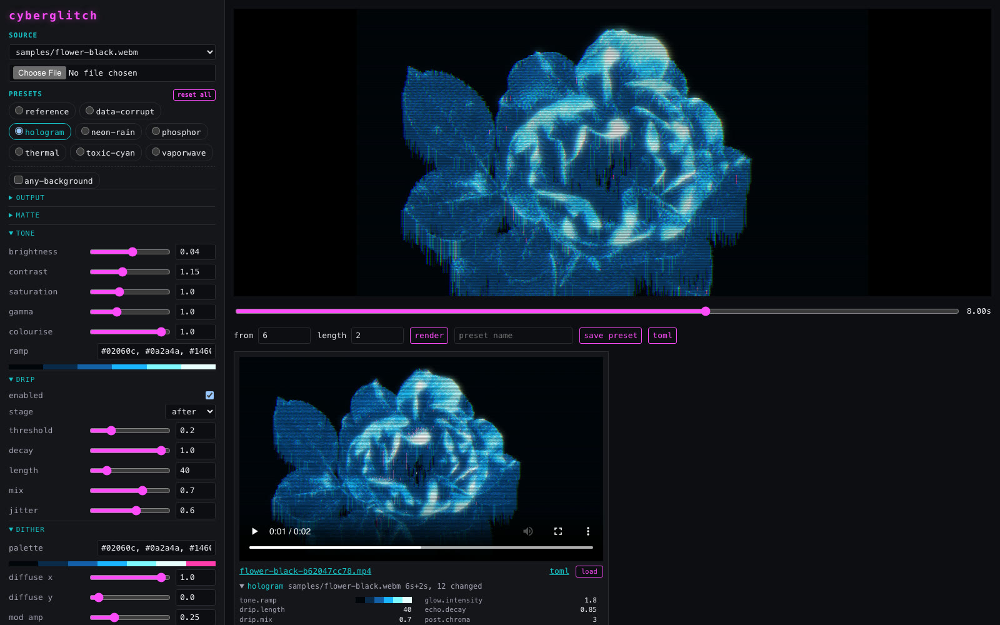
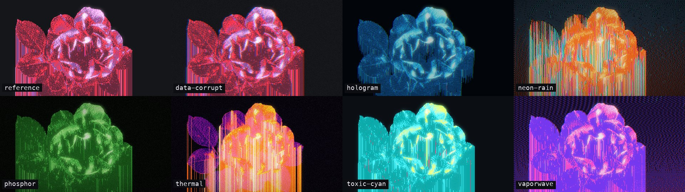

# cyberglitch

Cyberpunk palette dither, drip and bloom for video and images. Python, numba and ffmpeg, with a local web UI.




## Quick start

Needs Python 3.13+, [uv](https://docs.astral.sh/uv/) and ffmpeg. Developed on macOS (Apple silicon).

```sh
make install   # uv sync, including the rembg matte and web UI extras
make web       # http://127.0.0.1:8000
```

From the command line:

```sh
# Subject on a dark background: the built-in luma key is enough
uv run cyberglitch in.mp4 out/out.mp4

# Anything else: cut the subject out with the ML matte
uv run cyberglitch in.mp4 out/out.mp4 -p presets/any-background.toml

# Single frame (the output extension decides), with overrides
uv run cyberglitch in.mp4 out/frame.png --start 4 -s glow.intensity=2.2 -s drip.threshold=0.3

# Presets stack (later wins), --set wins over all
uv run cyberglitch in.mp4 out/rain.mp4 -p presets/any-background.toml -p presets/neon-rain.toml

uv run cyberglitch --dump-config   # every setting, valid as a preset
```

Output defaults to 1280x720 at the source frame rate, without audio (`-s output.audio=true` keeps it). `--start` / `--duration` trim the clip.

## Web UI



- Pick a clip from `samples/` or upload one, then pick a look. The UI starts on `hologram`; **reset all** returns to it
- Every setting is a slider generated from `config.py`. Hover a label for help, click ↺ to reset it
- The preview re-renders one frame after each change. The scrubber picks the frame
- **render** adds to a queue. Each tile has a stop button. When done it lists the presets and changed settings, links a `.toml` of them and can **load** them back into the editor
- **save preset** writes `presets/<name>.toml`

Uploads and renders go to `out/web/`. The server binds to localhost only.

## Presets



- `reference` - no preset. The built-in look recreated from the original clip, and the CLI default
- `hologram` - flickering blue projection, ghost trails, short drips; the web UI default
- `neon-rain` - sodium-orange smog, teal rain, scanlines
- `phosphor` - green CRT with occasional tears
- `thermal` - infrared surveillance ramp
- `vaporwave` - purple-to-pink haze, cyan accents
- `data-corrupt` - slice tears, channel swaps and trails
- `toxic-cyan` - palette swap
- `any-background` - turns on the rembg matte; stacks with any of the above

## Pipeline

Each frame is processed on a grid of `output.pixel`-sized blocks (2 px at 720p):

1. **matte** - isolate the subject: `luma` key, `rembg` (ML), or `none`
2. **tone** - contrast and brightness, then a gradient map through `tone.ramp`, so any subject comes out in the palette's colours
3. **haze**, **echo** - optional smog behind the subject and ghost trails
4. **dither** - row-wise error diffusion to `dither.palette`, modulated by a sine wave that follows the subject's shading
5. **drip** - each column smears its last bright subject pixel down to the bottom edge
6. **rain**, **glitch** - optional falling streaks and slice tears
7. **glow** - bright-pass blur, screen blended
8. **post** - optional chromatic aberration, scanlines, grain, vignette, flicker

Optional stages are off by default.

### Tweaking

- Streaks: `drip.threshold`, `drip.length`, `drip.jitter`, `drip.enabled=false`
- Pixel size: `output.pixel`
- Texture: `dither.mod_amp`, `dither.mod_luma` (band density), `dither.run_bias` (run length), `dither.mod_speed` (animate)
- Bloom: `glow.intensity`, `glow.radius`, `glow.threshold`
- Atmosphere: `haze.strength`, `rain.density`, `echo.decay`, `glitch.chance`, `post.scanlines`, `post.chroma`
- New look: copy a preset and keep `tone.ramp` ordered dark to light

## Performance

Kernels are numba-parallel. Decode, matte, render and encode run on separate threads. On an M5 Max a 720p clip renders at about 50 fps with the luma key and 15 fps with rembg.

rembg downloads its model (~176 MB) to `~/.rembg` on first use (`REMBG_HOME` moves it). On Apple silicon it runs on CoreML (GPU / Neural Engine), and the compiled model is cached under `$REMBG_HOME/coreml`. `matte.accelerate=false` forces CPU.

## Development

```sh
make check                                      # ruff + pytest
make presets IN=samples/flower-black.webm START=8   # one frame per preset, out/presets/sheet.jpg
```

## Origin

The idea came from [this r/Cyberpunk post](https://www.reddit.com/r/Cyberpunk/comments/1wxtlc3/roses_growth_testmp4tmp/). The `reference` look recreates its clip, which was made with the [Dither EYE](https://play.google.com/store/apps/details?id=com.dither.eye) Android app. Its exported preset gave the algorithm (`MODULATED_DIFFUSE_X`), pixel scale and 8-colour palette. The other values were tuned by eye against the clip's frames.

## Credits

Sample clips in `samples/` are from Wikimedia Commons. The images in `docs/` are made from `flower-black.webm`.

- `flower-black.webm` - [opening rose on black](https://commons.wikimedia.org/wiki/File:Time-lapse_of_opening_red_rose_isolated_on_black_background.Blooming_red_roses_flower_buds.webm), Alex Tr., CC BY 3.0
- `jellyfish-black.webm` - [jellyfish at Monterey Bay Aquarium](https://commons.wikimedia.org/wiki/File:Jellyfish_at_Monterey_Bay_Aquarium_4_2024-01-11.webm), Fastily, CC BY-SA 4.0
- `cactus-bloom-black.webm` - [Echinopsis flowers opening](https://commons.wikimedia.org/wiki/File:Antares_Hybrid_Echinopsis_Flower_Opening_Time_Lapse_..._Six_Flowers_at_Once.webm), EchinopsisFreak, CC BY 3.0
- `bloom.webm` - [flower blooming](https://commons.wikimedia.org/wiki/File:Time-lapse_of_a_flower_blooming.webm), Ajith Samuel, CC BY 3.0
- `waterlily.ogv` - [water lily](https://commons.wikimedia.org/wiki/File:Water_lily_time-lapse.ogv), solarissmoke, CC BY 3.0
- `neon-alley.mp4` - [Kabukicho neon](https://commons.wikimedia.org/wiki/File:Neo_Tokyo_-_Kabukicho_-TOKYO_-_JAPAN_tour.webm), Geisha Tv, CC BY 3.0, trimmed to 442-453 s and cropped
- `hk-night.mp4` - [Hong Kong Island at night](https://commons.wikimedia.org/wiki/File:Hong_Kong_Island_Night_Cityscape_2020.webm), Bert Brothers, CC BY 3.0, first 18 s

[htmx](https://htmx.org) is vendored under its BSD Zero-Clause licence.

## Licence

[MIT](LICENSE)
